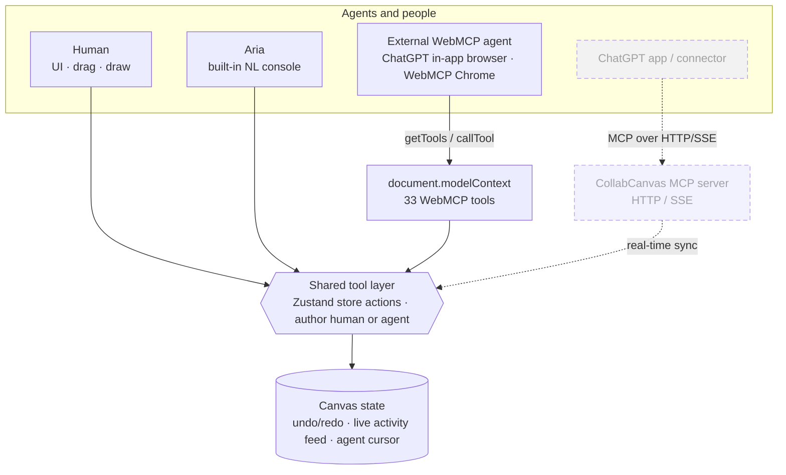

# 🎨 CollabCanvas

**A real-time collaborative infinite canvas where a human and their AI agent work the same live board — through [WebMCP](https://openai.com/webmcp-challenge/).**

You draw, arrange, and comment. Your agent — **Aria** — creates shapes, generates whole layouts from a sentence, restyles selections, tidies the board, answers questions about what's on it, and exports it. Both of you act on the *same* document, in real time, each with your own colored identity. No screen-sharing, no copy-paste, no "let me regenerate the whole thing" — just two collaborators on one canvas.

> Built for the **OpenAI WebMCP Challenge**. Every capability the UI has, the agent has too — because they call the exact same code.

---

## ✨ Why this is different

Most "AI + canvas" demos bolt a chatbot onto a drawing app: the model spits out an image or a blob of JSON and you take it or leave it. CollabCanvas is built the other way around.

- **One board, two authors.** The human and the agent are peers on a shared infinite canvas. Every element records who made it, and the agent has a live, animated cursor and presence chip so you can *see* it working.
- **WebMCP-native.** The page publishes **33 tools** on `document.modelContext`. Any WebMCP-aware agent — ChatGPT's in-app browser, a WebMCP-flagged Chrome, or the built-in Aria console — discovers and drives them automatically. The agent isn't scripted against a hidden API; it uses the same public tool surface anyone can inspect.
- **Symmetric architecture.** There is no separate "agent path." A WebMCP tool call and a button click both invoke the *same* Zustand store action, tagged with `author: 'agent' | 'human'`. That's why the agent can never do something the human can't, and vice-versa — and why undo/redo, styling, and history work identically for both.
- **The human stays in control.** The agent proposes and builds; you edit, undo, or clear anything. Say *"clear the board"* and start fresh.

---

## 🚀 Live demo

**▶️ Try it:** https://salmon-sea-0f045f10f.6.azurestaticapps.net

The board seeds a short welcome scene on first visit so the collaboration model is obvious the moment it loads. Open the **Aria** console (bottom-right) and type a request, or hit **Connect** (top bar) to see how to drive it from an external agent.

### Run it locally

```bash
npm install
npm run dev          # → http://localhost:5173
```

```bash
npm run build        # type-check + production build → dist/
npm run preview      # serve the production build locally
```

Requires Node 18+.

---

## 🤝 How the human and agent share the board

| The human does… | Aria (the agent) does… |
| --- | --- |
| Draw shapes, text, sticky notes, frames | Create the same elements via WebMCP tools |
| Drag, resize, restyle, group | `arrange_grid`, `align_elements`, `set_style`, `group_elements` |
| Sketch a rough idea | `generate_layout` — flowcharts, kanban, mind maps, grids, timelines, org charts from one line |
| Ask "what's on here?" | `summarize_board` — reads the canvas back to you |
| Want it out of the app | `export_svg` / `export_png` / `export_json` |
| Stay in control — undo, edit, clear | Signs its work, keeps a colored cursor + presence, logs every action to the shared activity feed |

Everything both parties do streams into a **live activity feed** in the Aria console, color-coded by author (violet = agent, blue = human), so the collaboration is legible at a glance.

---

## 🧰 WebMCP tool catalog (33 tools)

All tools are registered on `document.modelContext` and callable by any WebMCP host. Grouped by intent:

**Create (6)** — `create_shape` · `create_text` · `create_sticky_note` · `create_frame` · `create_connector` · `add_comment`

**Edit & arrange (10)** — `update_element` · `move_elements` · `set_style` · `delete_elements` · `duplicate_elements` · `group_elements` · `ungroup_elements` · `arrange_grid` · `align_elements` · `distribute_elements`

**Generate (2)** — `generate_layout` · `suggest_alternatives`

**Query & select (5)** — `get_board_state` · `find_elements` · `get_selection` · `select_elements` · `summarize_board`

**Export & load (4)** — `export_svg` · `export_png` · `export_json` · `load_board`

**View / camera (3)** — `set_camera` · `zoom_to_fit` · `focus_element`

**Board & agent identity (3)** — `clear_board` · `set_agent_presence` · `agent_say`

Inspect the live surface any time:

```js
document.modelContext.getTools()          // full definitions + JSON schemas
```

---

## 🧪 Testing it

### 1. The built-in agent (no setup)
Open the **Aria** console (bottom-right) and try:
- *"generate a kanban with To Do, Doing, Done"*
- *"make a flowchart: Start, Validate, Ship"*
- *"make everything blue"* (select some elements first, or say *"make everything…"* for the whole board)
- *"tidy everything into a grid"*
- *"what's on the board?"*
- *"export as SVG"*
- *"clear the board"*

### 2. In ChatGPT's in-app browser (WebMCP host)
1. Open the live URL inside ChatGPT's in-app browser.
2. The tools register automatically — ChatGPT discovers them via `document.modelContext`.
3. Ask ChatGPT to build something on the canvas ("add three sticky notes for our sprint goals and connect them"). It calls the tools directly; you watch the board update live.

### 3. From the DevTools console (any browser)
```js
await window.CollabCanvas.callTool('generate_layout', {
  kind: 'flowchart',
  items: ['Start', 'Validate?', 'Ship'],
})
```
`window.CollabCanvas` is exposed in both dev and the production bundle, so this works on the live site too.

---

## 🎬 Demo script (≈90s)

1. **Load** → the welcome board is already there. "The agent seeded this — notice it has its own cursor and identity."
2. **One sentence → a layout.** In Aria: *"generate a kanban with Backlog, In Progress, Review, Done."* Board fills instantly.
3. **Collaborate.** Grab a card, drag it, restyle it by hand — then tell Aria *"align the top row"* and *"make the headers violet."* Human and agent editing the same objects.
4. **Ask about the board.** *"What's on here?"* → Aria summarizes it back.
5. **Show the machinery.** Hit **Connect** → the modal lists all 33 live WebMCP tools and shows the exact `document.modelContext` handshake. "This is a public tool surface — any WebMCP agent can drive it."
6. **Export & reset.** *"Export as PNG"*, then *"clear the board."*

---

## 🏗️ Architecture



_Solid path = **shipped today** (in-page WebMCP). Dotted path = **roadmap** (a remote MCP server, so ChatGPT itself becomes the agent). Both converge on the **same store actions** — that convergence is the whole design._

- **`src/store/`** — Zustand store; every capability is an action taking an `author` tag. Single source of truth, with undo/redo history.
- **`src/mcp/`** — 33 tool definitions (`tools/*.ts`), a local registry so tools work even without a native WebMCP host, and `registerAll()` mirroring them onto `document.modelContext`.
- **`src/agent/`** — a rule-based natural-language interpreter (`intent.ts` → `runner.ts`) so the built-in Aria console turns plain English into tool calls, plus the first-run welcome seed.
- **`src/canvas/` & `src/ui/`** — the infinite-canvas renderer, coordinate transforms, toolbar, style panel, Aria console, and the Connect guide.

**Principle:** if the UI can do it, a tool exposes it; if a tool can do it, the UI can too. No divergence.

---

## 🗺️ What's next

CollabCanvas is built so its tool layer is **transport-agnostic**: the 33 capabilities are plain store actions, and WebMCP is simply one host sitting in front of them. That keeps the roadmap *additive, not a rewrite*:

- **Remote MCP server → ChatGPT *as* the agent.** Expose the same tool layer as a hosted MCP server (HTTP/SSE) and register it as a ChatGPT app/connector. ChatGPT itself becomes the collaborator — *"Create an onboarding flowchart"* becomes a `generate_layout(...)` call server-side — with no separate in-app agent to maintain.
- **Real-time multiplayer.** A CRDT layer (Yjs) so multiple humans *and* agents edit one board across devices. This is also the channel the remote-MCP path needs to broadcast server-side tool calls back to every open canvas — the two features reinforce each other.
- **Persistence & shareable rooms.** Named boards that survive reloads and open from a link.
- **Multi-agent presence.** Several named agents with distinct cursors, colors, and scoped permissions.

The through-line: *every new surface is just another caller of the same actions.* Add a transport, not a codebase.

---

## 🧱 Tech stack

Vite 8 · React 18 · TypeScript 5 (strict) · Zustand 5 · Tailwind v4 · [`@mcp-b/global`](https://www.npmjs.com/package/@mcp-b/global) WebMCP polyfill · nanoid

## ☁️ Deployment

Deployed as a fully static SPA to **Azure Static Web Apps** (WebMCP runs entirely in the browser — no backend required). SPA fallback routing is configured in `staticwebapp.config.json`. See that file and the deploy notes for the exact `swa deploy` flow.

## 📄 License

[MIT](./LICENSE) © 2026 Emmanuelzyronis
